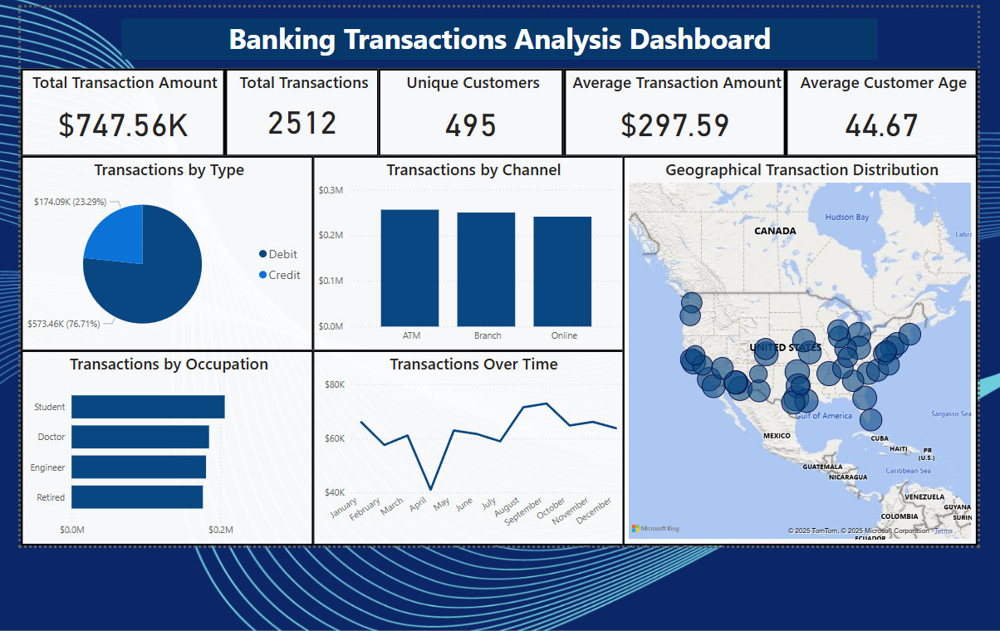
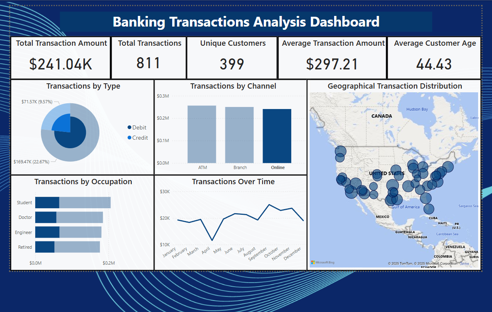

# 📊 Banking Transactions Analysis

## 📌 Overview
This project analyzes banking transaction data by performing data cleaning in SQL and creating visualizations and KPIs in Power BI. The goal is to gain insights into customer behavior, transaction trends, and financial performance.

## 🛠️ Technologies Used
- PostgreSQL (pgAdmin) - Data storage & cleaning
- Power BI - Data visualization & reporting
- DAX (Data Analysis Expressions) - KPI calculations & advanced metrics

## 📂 Project Structure
```
📦 Banking_Transactions_Analysis
├── 📂 data
│   ├── raw_bank_transactions_data.csv   
│   ├── cleaned_bank_transactions_data.csv   
│
├── 📂 sql_scripts
│   ├── data_cleaning_script.sql  
│
├── 📂 powerbi_reports
│   ├── Banking_Transactions.pbix  
│
```

## 🔍 Data Cleaning Steps
1. **Check & Remove Missing Values**
   - Identified NULL values in critical columns (TransactionID, Amount, Date)
   - Removed records with missing essential fields

2. **Standardized Data Formats**
   - Rounded TransactionAmount & AccountBalance to 2 decimal places
   - Trimmed spaces from text fields (TransactionType, Location, CustomerOccupation)

3. **Removed Duplicates**
   - Identified duplicate transactions based on TransactionID & Date
   - Kept the latest entry for each duplicate

4. **Validated Numerical Values**
   - Checked for negative amounts & unrealistic customer ages (<18 or >100)

## 📊 Power BI Dashboard Features
- **KPIs:**
  - Total Transaction Amount 💰
  - Average Transaction Amount 📉
  - Total Transactions 🔄
  - Unique Customers 👥
  - Average Customer Age 🕺

- **Charts & Visuals:**
  - **Transaction Amount by Channel** (ATM, Branch, Online)
  - **Transaction Distribution by Type** (Debit, Credit)
  - **Transaction Trends Over Time** ⏳
  - **Transactions by Customer Occupation** 🏢
  - **Geographic Analysis** 🌍

## 🖼️ Dashboard Screenshots
1. **Main Dashboard Overview** 📊
   - Displays key KPIs and transaction trends.


2. **Dynamic Filtering Example** 🔄
   - Demonstrates how selecting a parameter updates related charts dynamically.

